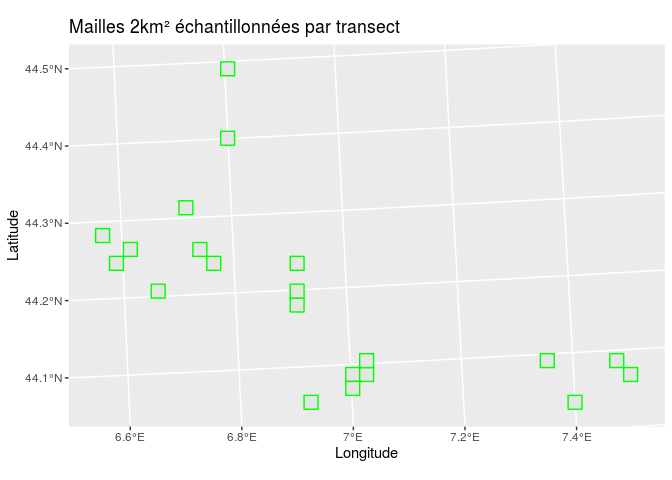
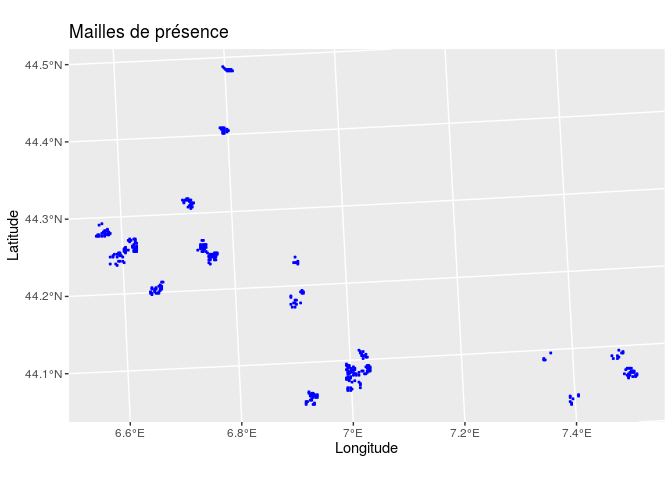
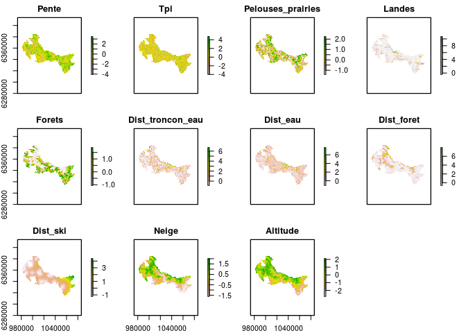
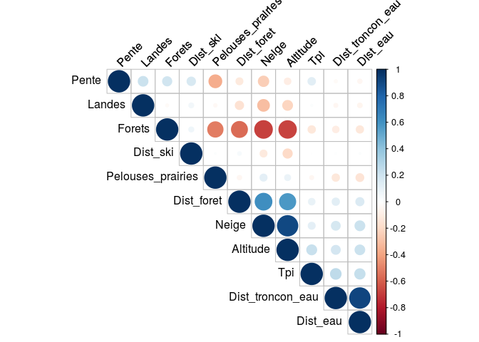
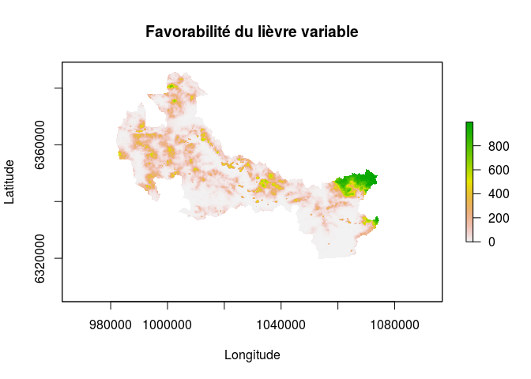
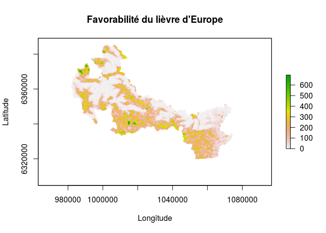

<!-- nécessaire pour éxécution des fct dans le Rmd  -->

<br/> 
<!-- saut de ligne  -->


##### Il était une fois quatre _tortues_ qui découvraient `RMarkdown` pour rédiger un rapport sur les _lièvres_ ...
<br/> 


## Présentation du projet
Objectifs : 
<!-- saut de ligne necessaire pour obtenir la liste -->
<!-- deux tabulations ou quatre espaces pour re-identer -->

* Présentation des __données__
    *  Points de présence - absence
    *  Variables explicatives
* Présentation de la __démarche d'analyse__
* Présentation des __cartes de répartition__

<br/> 


## Données
Nous présentons dans cette section les différentes données nécessaires pour réaliser la modélisation corrélative du lièvre d'Europe et du lièvre variable.

### Données de présence / absence
Dans le parc du Mercantour, des transects pour la recherche de fécès de lièvres sont réalisés dans des mailles de 2km². Cette maille d'échantillonnage est redécoupée en sous-maille de 100m². Les sous-mailles traversées par le transect sur lesquelles des fécès ont été prélevés correspondent à des points de présence, les autres traversées par le transect à des points d'absences, les autres non traversées par le transect à du background. Ces données absence-présence sont nécessaires pour la modélisation corrélative, cela nous évite de générer des données de pseudo-absences. 
<br/> 

Cette figure présente les mailles de 2km échantillonnées selon un suivi sur transect. Nous utilisons la fonction `dataSHP` pour lire le fichier _shapefile_, soit la couche de données et la fonction `plotSHP` pour afficher la couche de données. Ces mêmes fonctions sont ré-employées pour les deux figures suivantes. 
<br/> 


```r
Lievres::dataSHP("mailles_2019") %>%
  Lievres::plotSHP(title="Mailles 2km² échantillonnées par transect", color="green")
```

<!-- -->
<br/> 

Ci dessous, nous visualisons les transects parcourus au sein des mailles de 2km. 
<!-- -->
<br/> 

Enfin, nous observons les mailles de présence à la résolution 100 mètres.
<!-- -->

<br/> 


### Variables explicatives
De nombreuses variables explicatives sont disponibles. Nous présentons ici 11 variables, parmi les plus importantes pour expliquer la répartition de l'espèce.

<!-- -->

<br/> 


## Démarche d'analyse
L'analyse de répartition est réalisée selon de nombreuses étapes que nous réalisons à l'aide du package `biomod2`.
<br/> 

La première étape consiste à évaluer les corrélations entre les variables explicatives. 
<br/> 
<!-- -->

Nous observons ici que la variable forêt est l'une des plus corrélée aux autres, notamment aux variables "pelouses - prairies", "distance foret", "neige" et "altitude". 
<br/>

Les autres étapes sont les suivantes : 

* Sélection des variables sur critères de corrélation
* Calibration du pourcentage évaluation - validation
* Définition nombre de runs, modèles employés 
* ...
* Modélisation présent
* Modélisation d'ensemble
* Projection présent, obtention d'une carte de favorabilité pour les deux espèces

<br/> 


## Répartition des deux espèces
L'analyse permet d'obtenir une carte de favorabilité à l'état présent pour les deux espèces.

<!-- --><!-- -->

D'après nos résultats, le lièvre variable bénéficierait d'un habitat très favorable dans l'est du parc alors que l'habitat à l'ouest du parc serait plus favorable au lièvre d'Europe.
